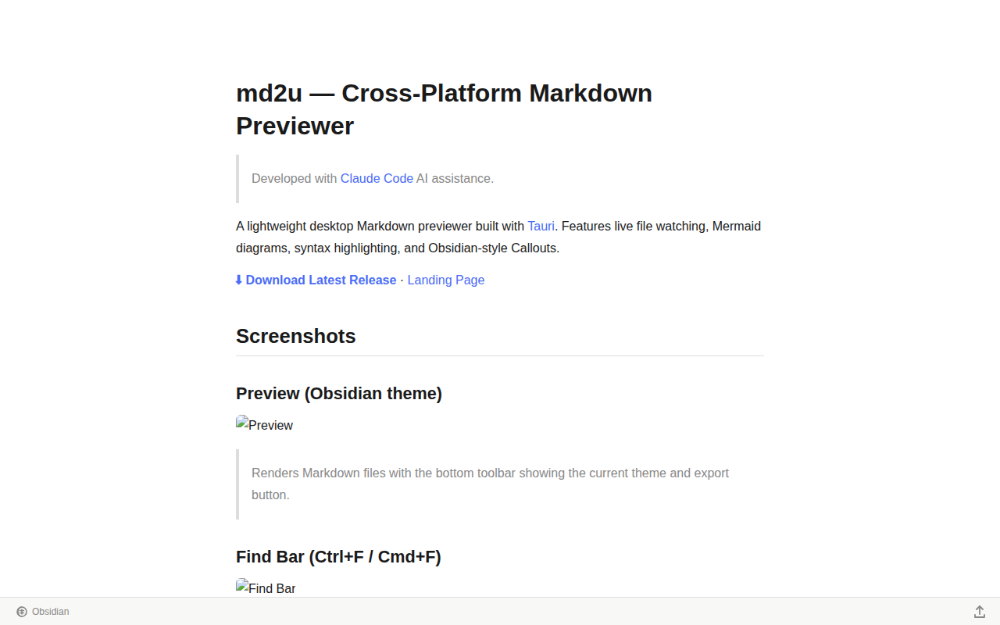
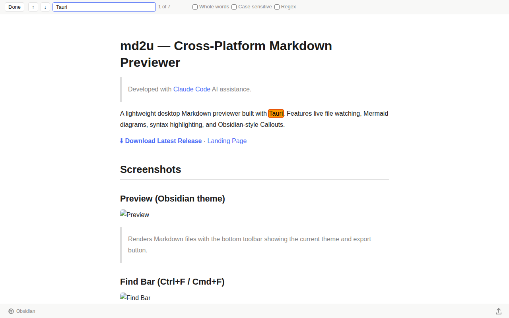
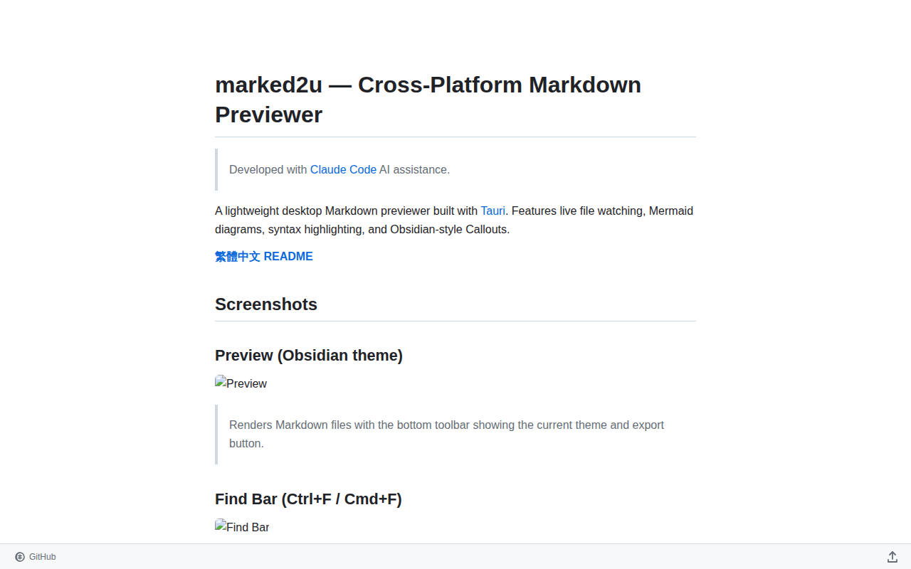
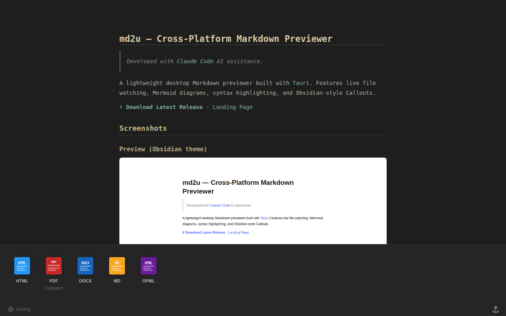

# md2u — Cross-Platform Markdown Previewer

> Developed with [Claude Code](https://claude.ai/code) AI assistance.

A lightweight desktop Markdown previewer built with [Tauri](https://tauri.app/). Features live file watching, Mermaid diagrams, syntax highlighting, and Obsidian-style Callouts.

**[⬇ Download Latest Release](https://github.com/stanwu/md2u/releases/latest)** · [Landing Page](https://md2u.stanwu.org)

## Screenshots

### Preview (Obsidian theme)

> Renders Markdown files with the bottom toolbar showing the current theme and export button.

### Find Bar (Ctrl+F / Cmd+F)

> Live full-text search with highlighter. Supports Whole words, Case sensitive, and Regex.

### CSS Theme Switcher

> 10 built-in themes: Obsidian, Swiss, Ink, Multi-Column, GitHub, Amblin, Upstanding Citizen, Lopash, Manuscript, Grump — plus Custom CSS. Switch with ⌘1–⌘9.

### Export Panel

> Click the share icon (↑) at the bottom right to export as HTML (with CDN), PDF (A4 paginated), DOCX, MD, or OPML.

## Features

- **Drag & Drop** — Drag any `.md` file onto the window to preview
- **CLI Launch** — Open a file from the terminal with `md2u yourfile.md`
- **Live Reload** — Auto-detects file changes and updates the preview on save
- **Syntax Highlighting** — Powered by [highlight.js](https://highlightjs.org/) for dozens of languages
- **Mermaid Diagrams** — Render flowcharts, sequence diagrams, and more inline
- **Obsidian Callouts** — Supports `[!NOTE]`, `[!WARNING]`, and other callout blocks
- **Find Bar** — Ctrl+F / Cmd+F full-text search with Whole words, Case sensitive, Regex
- **10 CSS Themes** — Built-in Obsidian, GitHub, Grump, and more; Custom CSS supported
- **Export** — One-click export to HTML, PDF, DOCX, MD, OPML
- **File Association** — Double-click `.md` / `.markdown` files to open after install
- **Window State** — Remembers last window size and position

## Getting Started

The fastest way: hand this repo to an AI agent.

### Prerequisites

- [Node.js](https://nodejs.org/) 18+
- [Rust](https://rustup.rs/) toolchain
- Tauri CLI [system dependencies](https://tauri.app/start/prerequisites/) (varies by OS)

### Install Dependencies

```bash
npm install
```

### Development Mode

```bash
npm run tauri dev
```

### Production Build

```bash
npm run tauri build
```

Output artifacts are in `src-tauri/target/release/bundle/`.

## Usage

**Drag & Drop**: Drag any `.md` file onto the md2u window.

**Command Line**:

```bash
md2u /path/to/yourfile.md
```

The preview updates automatically when the file is saved — no manual refresh needed.

## FAQ

**Q: What is md2u?**

md2u is a lightweight, open-source, cross-platform Markdown previewer built with Tauri. It uses the same rendering engine as Obsidian, supports syntax highlighting, Mermaid diagrams, 10 CSS themes, find-in-document, and one-click export to HTML, PDF, DOCX, and more.

**Q: Which platforms are supported?**

Windows (x64, ARM64) and Linux (`.deb`, `.rpm`) are available now. macOS support is planned.

**Q: Why no macOS (.dmg) yet?**

macOS requires all distributed apps to be signed and notarized by an Apple Developer account ($99/year). Unsigned `.dmg` files are blocked by Gatekeeper on macOS 13+. macOS support is planned once code signing is in place.

**Q: My antivirus flagged the installer — is it safe?**

This app is not yet code-signed. Some heuristic scanners may flag unsigned open-source binaries as suspicious. We are currently applying for code signing through [SignPath Foundation](https://signpath.org/) — thank SignPath Foundation for supporting open source projects like ours. Windows Defender and ClamAV both pass. Source code is fully public — verify it yourself or build from source.

**Q: Why scan for malware if binaries are built from source?**

Scanning at the artifact output stage detects known malicious signatures in the final binary, serving as the last layer of defense-in-depth. It complements dependency auditing, pinned package versions, and isolated build environments.

**Q: Why not use VirusTotal?**

The free VirusTotal API is limited to 1 request per day — not enough for CI/CD. This project uses platform-native alternatives: ClamAV on Linux and Windows Defender on Windows.

**Q: Is md2u free?**

Yes. md2u is completely free and open-source under the GNU General Public License v3.0. No account required.

**Q: Does md2u collect any data?**

No. md2u is a local desktop application. It collects no data, makes no network requests, and never sends anything anywhere. See the [Privacy Policy](https://md2u.stanwu.org/privacy-policy.html).

## Security

All release installers are compiled from source by GitHub Actions and scanned before publishing:

- **Linux** (`.deb`, `.rpm`) — Built on GitHub Ubuntu runner, scanned with [ClamAV](https://www.clamav.net/)
- **Windows** (`.exe`, `.msi`) — Built on GitHub Windows runner, scanned with Windows Defender

If any scan fails, the release is not published. View the full build log on the [Actions](../../actions) page.

## Tech Stack

| Layer | Technology |
|-------|-----------|
| Framework | Tauri v2 |
| Frontend | Vite + Vanilla JS |
| Markdown | markdown-it |
| Diagrams | Mermaid |
| Syntax Highlighting | highlight.js |
| Backend | Rust (`notify`, `tauri-plugin-window-state`) |

## License

This project is licensed under the [GNU General Public License v3.0](LICENSE).

## Policies

- [Code Signing Policy](CODE_SIGNING_POLICY.md)
- [Privacy Policy](PRIVACY_POLICY.md)

---

[繁體中文 README](README.zh-TW.md)
