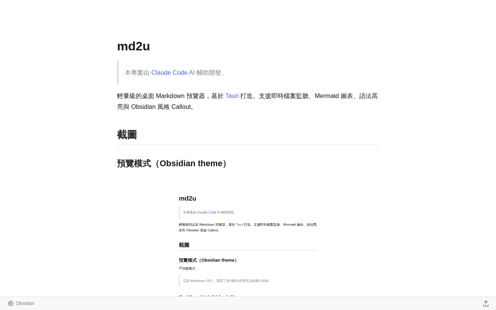
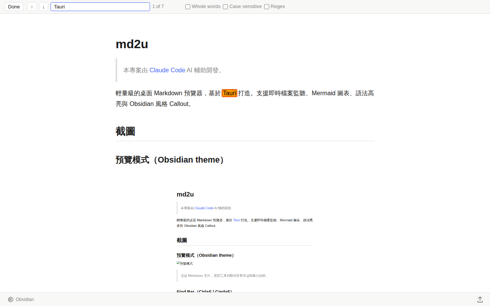
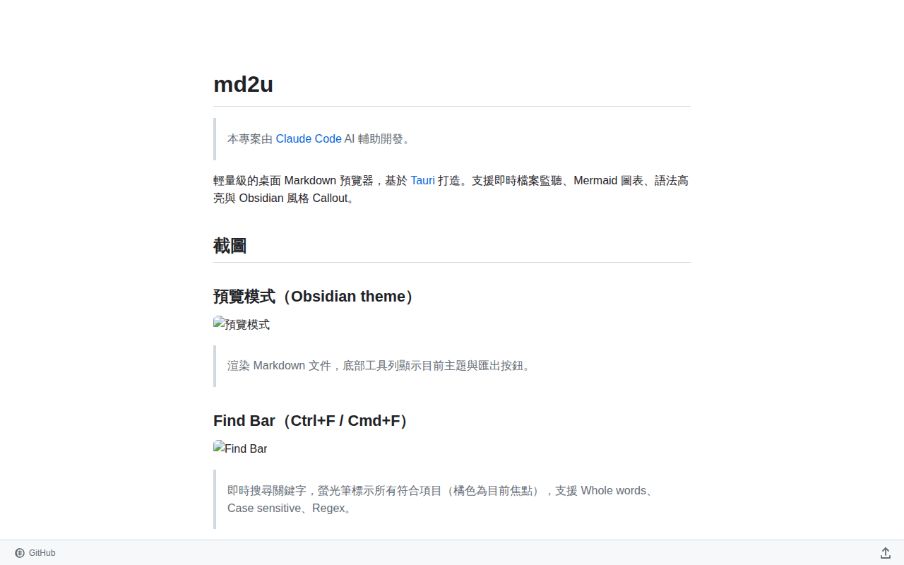
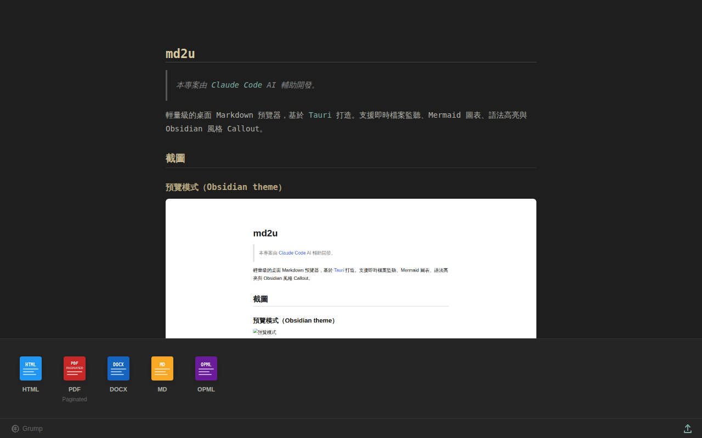

# marked2u

> 本專案由 [Claude Code](https://claude.ai/code) AI 輔助開發。

輕量級的桌面 Markdown 預覽器，基於 [Tauri](https://tauri.app/) 打造。支援即時檔案監聽、Mermaid 圖表、語法高亮與 Obsidian 風格 Callout。

## 截圖

### 預覽模式（Obsidian theme）

> 渲染 Markdown 文件，底部工具列顯示目前主題與匯出按鈕。

### Find Bar（Ctrl+F / Cmd+F）

> 即時搜尋關鍵字，螢光筆標示所有符合項目（橘色為目前焦點），支援 Whole words、Case sensitive、Regex。

### CSS Theme 切換

> 10 種內建主題：Obsidian、Swiss、Ink、Multi-Column、GitHub、Amblin、Upstanding Citizen、Lopash、Manuscript、Grump，以及 Custom CSS 自訂選項。快捷鍵 ⌘1–⌘9。

### Export 匯出

> 點選右下角分享圖示（↑）開啟匯出面板，支援 HTML（含 CDN）、PDF（A4 分頁）、DOCX、MD、OPML 五種格式。

## 功能特色

- **拖曳開啟** — 直接將 `.md` 檔案拖曳到視窗即可預覽
- **CLI 啟動** — 在終端機以 `marked2u yourfile.md` 開啟指定檔案
- **即時重新整理** — 儲存檔案後自動偵測變更並更新預覽
- **語法高亮** — 透過 [highlight.js](https://highlightjs.org/) 支援數十種程式語言
- **Mermaid 圖表** — 直接在 Markdown 中渲染流程圖、時序圖等
- **Obsidian Callout** — 支援 `[!NOTE]`、`[!WARNING]` 等提示區塊
- **Find Bar** — Ctrl+F / Cmd+F 全文搜尋，支援 Whole words、Case sensitive、Regex
- **10 種 CSS Theme** — 內建 Obsidian、GitHub、Grump 等主題，支援 Custom CSS
- **匯出** — 一鍵匯出 HTML（含 CDN）、PDF、DOCX、MD、OPML
- **檔案關聯** — 安裝後可直接雙擊 `.md` / `.markdown` 檔案開啟
- **視窗狀態記憶** — 記住上次視窗大小與位置

## 快速開始

最快的方法：將本專案丟給 AI agent 處理即可

### 開發環境需求

- [Node.js](https://nodejs.org/) 18+
- [Rust](https://rustup.rs/) 工具鏈
- Tauri CLI 的[系統相依套件](https://tauri.app/start/prerequisites/)（依作業系統而異）

### 安裝相依套件

```bash
npm install
```

### 開發模式

```bash
npm run tauri dev
```

### 建置正式版本

```bash
npm run tauri build
```

編譯產物位於 `src-tauri/target/release/bundle/`。

## 使用方式

**拖曳**：將任意 `.md` 檔案拖曳到 marked2u 視窗。

**命令列**：

```bash
marked2u /path/to/yourfile.md
```

檔案儲存後，預覽會自動更新，無需手動重新整理。

## 安全性

Release 頁面提供的所有安裝檔均由 GitHub Actions 從原始碼自動編譯，並在發布前完成掃毒驗證：

- **Linux**（`.deb`、`.rpm`）— 由 GitHub Ubuntu runner 編譯，經 [ClamAV](https://www.clamav.net/) 掃描
- **Windows**（`.exe`、`.msi`）— 由 GitHub Windows runner 編譯，經 Windows Defender 掃描

掃毒任一不通過，Release 即不發布。你可以在 [Actions](../../actions) 頁面查看每次 Release 的完整 build log。

### FAQ

**Q：已經是從原始碼自動編譯，為何還要掃毒？**

為確保端點與發布產物的安全，我們在 CI/CD pipeline 的產物輸出階段執行惡意程式碼掃描，用以偵測已知特徵的惡意 binary。此措施作為縱深防禦的最後一層，需搭配依賴審計、套件版本鎖定與 build 環境隔離，才能覆蓋完整的供應鏈威脅面。

**Q：為何不使用 VirusTotal？**

VirusTotal 免費 API 限制為每日 1 次請求，不足以支援 CI/CD 流程（每次 Release 需掃描 4 個檔案）。本專案採用開源替代方案，在各平台原生環境直接掃描：Linux 使用 ClamAV、Windows 使用 Windows Defender。

**Q：為何沒有 macOS (.dmg)？**

macOS 要求安裝檔必須經過 Apple 開發者簽章與 Notarization，未簽章的 `.dmg` 在 macOS 13+ 上會被 Gatekeeper 封鎖無法執行。本專案目前尚未取得 Apple Developer 憑證（每年需要 99 美元），待日後本專案自己有足夠資金支持取得後再提供 macOS 版本。

## 技術棧

| 層級 | 技術 |
|------|------|
| 框架 | Tauri v2 |
| 前端 | Vite + Vanilla JS |
| Markdown | markdown-it |
| 圖表 | Mermaid |
| 語法高亮 | highlight.js |
| 後端 | Rust (`notify`、`tauri-plugin-window-state`) |

## 授權

本專案採用 [GNU General Public License v3.0](LICENSE)。
